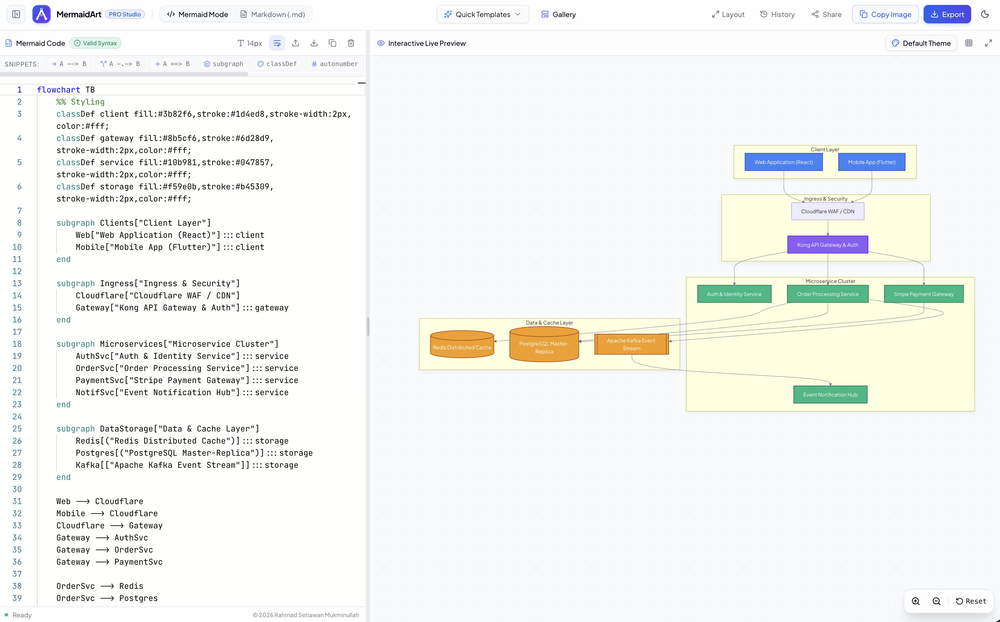

# 🌊 MermaidArt — Live Mermaid & Markdown Diagram Studio & Exporter

<div align="center">


<br />
[](https://react.dev/)
[](https://www.typescriptlang.org/)
[](https://vitejs.dev/)
[](https://tailwindcss.com/)
[](https://mermaid.js.org/)
[](LICENSE)

A modern, fast, and feature-rich online **Mermaid & Markdown Live Diagram Editor & High-Resolution Exporter**. Built with React 19, TypeScript, Monaco Editor, and Tailwind CSS + shadcn/ui.

<br />



<br />
<br />

[Key Features](#-key-features) • [Tech Stack](#-tech-stack) • [Getting Started](#-getting-started) • [Export Options](#-export--download-options) • [Project Structure](#-project-structure) • [Author & Copyright](#-author--copyright)

</div>

---

## ✨ Key Features

### 1. ⚡ Dual-Pane Live Studio & VS Code-Grade Editor
- **Monaco Editor Engine**: Professional in-browser code editing experience (syntax tokenization, line numbers, code folding, font sizing from 12px to 16px, and word wrap toggle).
- **Snippets Toolbar**: One-click quick insertion for common Mermaid syntax (`-->`, `-.->`, `==>`, `subgraph`, `classDef`, `autonumber`, `Note over`, and `erDiagram`).
- **Dual Mode (Mermaid & Markdown)**:
  - **Mermaid Mode**: Pure Mermaid diagram editor and syntax validator.
  - **Markdown (`.md`) Mode**: Parse standard Markdown documentation containing ````mermaid ... ```` code blocks with an automatic multi-diagram tab navigator.

### 2. 🔍 Interactive Pan & Zoom Canvas (Full-Width to Right)
- **Smooth Pan & Zoom Controls**: Drag/pan canvas, zoom in/out with mouse wheel or buttons, reset (1:1), and fit-to-screen.
- **Full-Width Canvas & Resizable Splitter**: Draggable divider handle to freely customize pane widths, plus a sidebar toggle to collapse the editor and expand the canvas to **100% full screen**.
- **Built-in Diagram Themes**: Instant switching between Mermaid themes (*Dark Slate, Default Light, Forest Green, Neutral Monochrome, Base*).
- **Canvas Background Options**: Dot Grid Pattern, Clean Solid, or Transparent Grid.
- **Real-Time Error Diagnostics**: Live syntax validation and detailed error banners without crashing the application.

### 3. 🖼️ High-DPI Export & Direct Clipboard Engine
- **Multiple Output Formats**: Export diagrams to **PNG**, **SVG** (crisp vector format), **JPEG**, or **WebP**.
- **Resolution Scaling**: Scale factors from **1x (Standard)**, **2x (Retina High-Res)**, **3x (Print Quality)**, to **4x (Ultra HD 4K)**.
- **Customizable Backgrounds**: Transparent background (*alpha channel*), Pure White, Dark Slate, or Custom Hex Color Picker.
- **Custom Margin & Filename**: Configure diagram padding (8px, 16px, 24px, 40px) and custom download filenames.
- **Direct Clipboard Copy**: Copy PNG images or SVG code straight to your OS clipboard for instant pasting (*Ctrl+V / Cmd+V*) into Slack, Notion, Word, Google Docs, Figma, or WhatsApp.

### 4. 🗂️ Template Gallery & Productivity Tools
- **Ready-to-Use Diagram Gallery**:
  - *Cloud & Microservices Architecture* (TB/LR Flowchart)
  - *OAuth 2.0 & JWT Authentication Flow* (Sequence Diagram)
  - *E-Commerce Relational Database Schema* (ER Diagram)
  - *Order Lifecycle State Machine* (State Diagram)
  - *Clean Architecture OOP Domain Model* (Class Diagram)
  - *GitFlow Branching & Release Strategy* (Git Graph)
  - *Product Strategy Mindmap* (Mindmap)
  - *Sprint Release Roadmap* (Gantt Chart)
  - *Tech Stack Usage Breakdown* (Pie Chart)
  - *Markdown Documentation Sample* (.md with multi-diagram)
- **Auto-Save & History**: Continuous auto-saving to browser LocalStorage and a dedicated *History* dialog to restore previous diagrams.
- **Drag & Drop File Import**: Drop `.mmd`, `.md`, or `.txt` files directly onto the editor to load them.
- **Shareable URL**: Encode diagram state into a shareable URL hash.
- **Dark & Light Mode**: Seamless dark and light themes with system glassmorphism.

---

## 🛠️ Tech Stack

| Category | Technology | Description |
| :--- | :--- | :--- |
| **Framework** | [React 19](https://react.dev/) + [Vite](https://vitejs.dev/) | High-performance modern frontend tooling |
| **Language** | [TypeScript](https://www.typescriptlang.org/) | Type-safe static analysis |
| **Styling & UI** | [Tailwind CSS](https://tailwindcss.com/) + [shadcn/ui](https://ui.shadcn.com/) | Curated design tokens, Radix UI primitives, glassmorphism |
| **Code Editor** | [@monaco-editor/react](https://github.com/suren-atoyan/monaco-react) | VS Code core editor in the browser |
| **Diagram Engine**| [Mermaid.js](https://mermaid.js.org/) | Dynamic diagramming and charting engine |
| **Canvas Controls**| [react-zoom-pan-pinch](https://github.com/BetterTyped/react-zoom-pan-pinch) | Smooth pan, zoom, pinch, and gestures |
| **Export Engine** | Canvas 2D + SVG Rasterizer | High-DPI rasterization and Clipboard API |
| **Icons** | [Lucide React](https://lucide.dev/) | Modern and clean stroke icons |
| **Notifications** | [Sonner](https://sonner.emilkowal.ski/) | Elegant toast notification system |

---

## 🚀 Getting Started

### 1. Prerequisites
Ensure you have **Node.js** (v18 or higher) and **npm** installed on your system.

### 2. Navigate to Project Directory
```bash
cd /Users/macbookpro/Documents/build-portfolio/diagram-maker
```

### 3. Install Dependencies
```bash
npm install
```

### 4. Start Development Server
```bash
npm run dev
```

Open the local development URL in your browser (typically **`http://localhost:5173/`**).

### 5. Run Unit Tests
```bash
npm test
```
To run tests in watch mode during development:
```bash
npm run test:watch
```

### 6. Build for Production
```bash
npm run build
```
Production bundle assets will be generated in the `dist/` directory.

---

## 📦 Export & Download Options

| Format | Primary Use Case | Transparent Background Support |
| :--- | :--- | :---: |
| **PNG** | High-definition raster images (1x to 4x Ultra HD) for docs, presentations, & web | ✅ Yes |
| **SVG** | Lossless vector format for Figma, Illustrator, and web integration | ✅ Yes |
| **JPEG** | Standard compressed format with solid background | ❌ No |
| **WebP** | Modern lightweight image format for fast web delivery | ✅ Yes |
| **Copy Image** | Copy PNG directly to OS clipboard for instant paste (*Ctrl+V / Cmd+V*) | ✅ Yes |
| **Download Source** | Save diagram source code as `.mmd` or `.md` | N/A |

---

## 📁 Project Structure

```text
diagram-maker/
├── public/
│   ├── favicon.svg               # Application SVG icon
│   └── icons.svg
├── src/
│   ├── components/
│   │   ├── ui/                   # Atomic shadcn/ui components (Button, Dialog, Select, etc.)
│   │   ├── EditorPane.tsx        # Monaco Code Editor & snippet toolbar
│   │   ├── ExportModal.tsx       # Export modal dialog (PNG/SVG/JPEG/WebP)
│   │   ├── HistoryDialog.tsx     # Saved diagrams history dialog
│   │   ├── LogoIcon.tsx          # Application Logo Icon
│   │   ├── Navbar.tsx            # Top header navbar & actions
│   │   ├── PreviewPane.tsx       # Interactive live preview canvas with pan & zoom
│   │   ├── SnippetBar.tsx        # Fast Mermaid syntax insertion shortcuts
│   │   └── TemplateDialog.tsx    # Diagram template catalog & gallery
│   ├── data/
│   │   └── templates.ts          # Mermaid & Markdown diagram presets collection
│   ├── lib/
│   │   ├── export-engine.ts      # High-DPI SVG to Canvas/Blob rasterizer & clipboard tools
│   │   ├── mermaid-renderer.ts   # Mermaid syntax parser and live renderer
│   │   ├── storage.ts            # LocalStorage persistence & URL state sharing
│   │   └── utils.ts              # Tailwind merge & clsx utilities
│   ├── test/
│   │   └── setup.ts              # Vitest test environment setup and mocks
│   ├── App.tsx                   # Main root application component & layout state
│   ├── index.css                 # Global CSS design tokens, dot-grid canvas & themes
│   └── main.tsx                  # React entry point
├── index.html                    # HTML shell & web font imports
├── mermaidart-screenshot.png     # Application screenshot preview
├── package.json
├── tailwind.config.js
├── tsconfig.json
└── vite.config.ts
```

---

## 📄 License

This project is licensed under the [MIT License](LICENSE).
Free to use, modify, and distribute for personal and commercial projects.

---

## 👨‍💻 Author & Copyright

Crafted with ❤️ by **Rahmad Setiawan Mukminullah**

Copyright © 2026 **Rahmad Setiawan Mukminullah**. All rights reserved.
